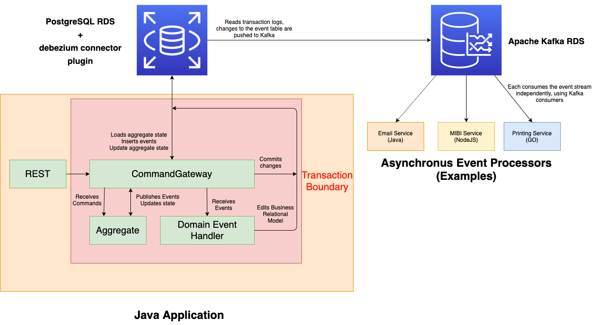

# Domain Driven Design (DDD) - Prototype

## Introduction

This repository is a **prototype** for a Domain Driven Design framework.\
Inspired by the [Axon Framework](https://docs.axoniq.io/reference-guide/). Similar to Axon
this framework follows the **Command** -> **Aggregate** -> **Event** flow, however with some
notable differences:

1. Aggregates are **not** Event Sourced
2. Asynchronous event listeners are driven off a message stream, not a database table

While every module of this framework is abstracted out. The default implementation uses
an [Apache Kafka](https://kafka.apache.org/) event stream coupled with [PostgreSQL](https://www.postgresql.org/).
This means events are driven off the PostgreSQL replication logs and not a separate call to Kafka
or any other messaging implementation. Thus, greatly reducing transaction complexity.

Since an external messaging technology standard is used, the domain is not tied to one
language.

## Architecture diagram

Below is a (slightly shake-y) diagram of what a domain would look like using this framework.



The flow is as follows:
1. Commands are sent to the CommandGateway (**Transaction Starts**)
2. Aggregate state is loaded, either from the database or a new one is created
3. The aggregate applies one or more events
4. The aggregate updates it's state
5. Domain event handlers are called for each event. These would update any business query models 
used directly by the domain
6. The SQL connection commits. Aggregate state, events and business tables are all update in the same
transaction (**Transaction Ends**)
7. The debezium plugin detects a change within the event table. It will then publish the changes to
Kafka
8. The event consumers poll Kafka for new events, when new events are discovered, they are processed

## Using the framework

The framework comes with out-of-the-box **Spring Boot 2** integration, each of the following examples
will show how to use the framework with and without Spring.

### Dependencies

Add the following to your `pom.xml`:

#### No Spring
```xml
<properties>
    <ddd.version>1.1.0</ddd.version>
</properties>

<dependencies>

    <dependency>
        <groupId>com.moppletop.ddd</groupId>
        <artifactId>ddd-framework</artifactId>
        <version>${ddd.version}</version>
    </dependency>
    
    <dependency>
        <groupId>com.moppletop.ddd</groupId>
        <artifactId>ddd-event-broker-kafka</artifactId>
        <version>${ddd.version}</version>
    </dependency>

</dependencies>
```

#### Spring

```xml
<properties>
    <ddd.version>1.1.0</ddd.version>
</properties>

<dependency>
    <groupId>com.moppletop.ddd</groupId>
    <artifactId>ddd-spring-boot-kafka-starter</artifactId>
    <version>${ddd.version}</version>
</dependency>
```

### Plumbing

The **Command** -> **Aggregate** -> **Event** flow is separated from the polling of events, so you can ignore anything related
to the `EventGateway` and `KafkaEventStream` if you are not having any stream driven event handlers in your application. The same
applies for the opposite, only create the `EventGateway` and `KafkaEventStream` objects if you're app is simply polling the
events.

#### No Spring
```java
public MyApp(DataSource dataSource) {
    this.dependencyRegister = new ExplicitDependencyRegister();
    // Note this requires Jackson 2 on the classpath!
    // If you are using another serialisation library, implement your own ObjectTransformer
    this.objectTransformer = new JacksonObjectTransformer();
    this.aggregateRepository = new JdbcAggregateRepository(objectTransformer);
    this.eventRepository = new JdbcEventRepository(objectTransformer);
    this.wiringManager = new ExplicitWiringManager(dependencyRegister);
    this.commandGateway = new DefaultCommandGateway(
            dataSource,
            aggregateRepository,
            eventRepository,
            wiringManager
    );
    this.eventGateway = new DefaultEventGateway(wiringManager);
    this.queryGateway = new DefaultQueryGateway(wiringManager);

    this.eventStreamer = KafkaEventStream.builder()
            .groupId("my-app")
            .topic("dbserver1.public.event")
            .kafkaHost("kafka:9092")
            .pollingRate(Duration.ofSeconds(1))
            .objectTransformer(objectTransformer)
            .eventGateway(eventGateway)
            .build();
}
```

#### Spring
The `ddd-spring-boot-kafka-starter` will bring in an autoconfigure that will essentially do what is done
in the No Spring section for you. It will also register beans in the default application context for all those objects.
If you want to configure the properties of the `KafkaEventStream` you can add the following
to your `application.yaml` or `application.properties`:

```yaml
ddd:
  kafka:
    groupId: my-app
    topic: dbserver1.public.event
    pollingRate: 1000 # This is the default
    kafkaHosts:
      - kafka:9092
```

#### Plumbing your DataSource
From the point a command is sent, until the connection is committed, there is a transaction boundary where a database connection
is opened and has statements executed against it. One way of your business logic getting access to this connection is have a
`ConnectionProvider` as a parameter to your event handler. Like this:

```java
@DomainEventHandler
public void handle(CustomerRegistered event, ConnectionProvider connectionProvider) {
    // Don't close or commit the connection, that will be handled for you!
    // Read the following section on how to do better handle connections
    Connection connection = connectionProvider.getConnection();

    connection.prepareStatement(...);
}
```

Having to remember not to close or commit connections isn't very intuitive or very ideal when having to integrate with
another library which you want to integrate with, or an ORM like JPA & Hibernate. 
The way around this is wrapping your `DataSource` in a `TransactionAwareDataSourceProxy`.
This will ensure that all transaction management is handled by the framework, when a thread is in a transaction, calls to
`DataSource#getConnection()` will return the connection used by the current transaction. Though this connection will also be
wrapped in a `TransactionAwareConnectionProxy`, which will have `commit()`, `rollback()` and `close()` edited to do nothing.
Now you don't have to worry about integrating other libraries with the framework.

```java
private final DataSource dataSource; // This datasource would actually be a "new TransactionAwareDataSourceProxy(theActualDataSourceObj)"

@DomainEventHandler
public void handle(CustomerRegistered event) {
    // Even though this try-with=resources would call close() on the connection, nothing will actually happen
    try (Connection connection = dataSource.getConnection()) {
        connection.prepareStatement(...);
    }
}
```

### Creating the tables
Below is the SQL for the tables the framework requires by default
```postgresql
-- Framework Tables
CREATE TABLE aggregate
(
    global_id            bigserial primary key,
    aggregate_identifier uuid unique not null,
    class_name           varchar(255) not null,
    event_sequence       bigint not null,
    current_state        json not null
);

CREATE TABLE event
(
    global_sequence      bigserial primary key,
    aggregate_global_id  bigint references aggregate(global_id),
    class_name           varchar(255) not null,
    payload              json not null,
    metadata             json not null
);

CREATE INDEX event_aggregate_global_id_index ON event (aggregate_global_id);
-- End of Framework Tables
```

### Creating an aggregate

If you are using **Lombok**, these classes can have a lot of their boilerplate removed, take a look at the Driver example 
for very similar classes but with lombok.

Do note that in the following classes, I have removed some imports/getters for brevity.

#### Command
```java
package mydomain.command;

import com.moppletop.ddd.command.Command;

public class RegisterCustomer implements Command<CustomerAggregate> {

    private final UUID id;
    private final String name;
    private final LocalDate dateOfBirth;

    public RegisterCustomer(UUID id, String name, LocalDate dateOfBirth) {
        this.id = id;
        this.name = name;
        this.dateOfBirth = dateOfBirth;
    }

    @Override
    public UUID getTargetAggregateIdentifier() {
        return id;
    }

    // getters...
}
```

#### Event

The event in this example is very similar to the command. In more complex domains there isn't such an easy 1-to-1 relationship

```java
package mydomain.event;

public class CustomerRegistered {

    private final UUID customerId;
    private final String name;
    private final LocalDate dateOfBirth;

    public CustomerRegistered(UUID customerId, String name, LocalDate dateOfBirth) {
        this.customerId = customerId;
        this.name = name;
        this.dateOfBirth = dateOfBirth;
    }

    // getters...
}
```

#### Aggregate

```java
package mydomain.aggregate;

import com.moppletop.ddd.aggregate.AggregateStateHandler;
import com.moppletop.ddd.command.CommandHandler;

import static com.moppletop.ddd.aggregate.AggregateState.apply;

public class CustomerAggregate {

    private UUID id;
    private String name;
    private LocalDate dateOfBirth;

    // No arg constructor required when loading the state into an object
    public CustomerAggregate() {
    }

    // Initial state command
    @CommandHandler
    public CustomerAggregate(RegisterCustomer cmd) {
        apply(new CustomerRegistered(cmd.getTargetAggregateIdentifier(), cmd.getName(), cmd.getDateOfBirth()));
    }

    // Updates the aggregate according to the contents of the event
    @AggregateStateHandler
    private void on(CustomerRegistered evt) {
        id = evt.getCustomerId();
        name = evt.getName();
        dateOfBirth = evt.getDateOfBirth();
    }
}
```

#### No Spring
To register an aggregate with the framework, add this to where you do your initial plumbing of the other managers.
```java
wiringManager.registerAggregate(CustomerAggregate.class);
```

#### Spring
Once the `ApplicationContext` has loaded, the framework will look for beans annotated with `@WiredAggregate`, this annotations
inherits `@Component` so as long as your aggregate class is picked up by a `@ComponentScan` or is created explicitly it will
be registered.
Note, when I say inherits `@Component`, it's scoping is set to `prototype` so a new instance is created every time, to simplify your
configuration, it's recommended to just have them be picked up be a `@ComponentScan`.

```java
package mydomain.aggregate;

import com.moppletop.ddd.spring.WiredAggregate;

@WiredAggregate
public class CustomerAggregate {
    
    // command handlers, state handlers etc...

}
```

### Domain Event Handlers

These event handlers are invoked during the event application (`AggregateState.apply(...)`) process.
This is where you'd update any business tables or do any logic which needs to happen inside the command transaction.
Domain Event Handlers can be compared to Axon's subscribing processors.

```java
package mydomain.eventhandler.domain;

import com.moppletop.ddd.event.DomainEventHandler;

public class CustomerReadModelEventHandler {

    private final CustomerRepository repository;

    public CustomerReadModelEventHandler(CustomerRepository repository) {
        this.repository = repository;
    }
    
    @DomainEventHandler
    public void handle(CustomerRegistered event) {
        repository.insertCustomer(CustomerEntity.builder()
                .customerId(event.getCustomerId())
                .name(event.getName())
                .dateOfBirth(event.getDateOfBirth())
                .build());
    }
}
```

#### No Spring
To register an object with domain event handlers in it with the framework, add this to where you do your initial plumbing of the other managers.
```java
wiringManager.registerDomainEventHandlers(new CustomerReadModelEventHandler(repository));
```

#### Spring
Once the `ApplicationContext` has loaded, the framework will look for beans annotated with `@WiredEventHandlers`, this annotations
inherits `@Component` so as long as your aggregate class is picked up by a `@ComponentScan` or is created explicitly it will
be registered.

```java
package mydomain.eventhandler.domain;

import com.moppletop.ddd.spring.WiredEventHandlers;

@WiredEventHandlers
public class CustomerReadModelEventHandler {
    
    // domain event handlers

}
```

The `@WiredEventHandlers` annotation is used for both domain and stream handlers, by default both annotations are scanned, you can disable the scanning
of these in the annotation itself.

### Stream Event Handlers
So now that we've got the data into the event stream, how are we going to listen to the events?\
The framework supports Stream Event Handlers, these function exactly the same as Domain Event Handlers, except they are
outside the command transaction boundary and are driven off the events from the event stream.

In the Kafka implementation, event are **polled**, by default up to **50** a cycle. They are then deserialised and any registered
stream event handlers for that event are invoked.

```java
package mydomain.eventhandler.stream;

import com.moppletop.ddd.event.StreamEventHandler;
import com.moppletop.ddd.event.ProcessingGroup;

@ProcessingGroup(name = "email", threads = 2)
public class CustomerEmailEventHandler {

    private final EmailSender emailSender;

    public CustomerEmailEventHandler(EmailSender emailSender) {
        this.emailSender = emailSender;
    }
    
    @StreamEventHandler
    public void handle(CustomerRegistered event) {
        // I know the customer aggregate didn't store email, but you get the idea
        emailSender.sendWelcomeEmail(event.getEmail());
    }
}
```

Any exception thrown within an event handler will cause the processing of the current cycle to stop. The current events that have
been successfully processed will be committed/marked as processed. The processor will back-off for **1 second** and will poll
the events again, subsequently the first event will be the one that threw the exception last time (unless there is a partition change).

Annotating the class with `@ProcessingGroup` allows you to customise the number of concurrent threads that will process events from the partition.
A general rule of thumb is that this number should equal `numberOfPartitions / numberOfNodes` this would mean that one thread would process
one partition. If one node goes down, the others will pickup the remaining partitions until it comes back online

#### No Spring
To register an object with stream event handlers in it with the framework, add this to where you do your initial plumbing of the other managers.
```java
wiringManager.registerStreamEventHandlers(new CustomerStreamEventHandler());
```

#### Spring
Once the `ApplicationContext` has loaded, the framework will look for beans annotated with `@WiredEventHandlers`, this annotations
inherits `@Component` so as long as your aggregate class is picked up by a `@ComponentScan` or is created explicitly it will
be registered.

```java
package mydomain.eventhandler.stream;

import com.moppletop.ddd.spring.WiredEventHandlers;

@WiredEventHandlers
public class CustomerStreamEventHandler {
    
    // stream event handlers

}
```

The `@WiredEventHandlers` annotation is used for both domain and stream handlers, by default both annotations are scanned, you can disable the scanning
of these in the annotation itself.

## Problems and possible improvements

While I am quite proud of this prototype, (considering it took just over a week and went through a couple of iterations).

+ There is a distinct lack of tests for the framework
+ There is no testing framework for users of the framework. Given this aggregate state, When this command is sent, Then these events should be applied
+ The WiringManager is quite a mess, I plan on separating that out into multiple classes
+ The framework expects you to not misconfigure it, for example having multiple `@ProcessingGroup` with the same name
+ The EventMetadata is never used for anything
+ There are no command or event interceptors for logging, metadata inclusion etc...
+ By default the connector uses JSON to send schema changes, while this works fine for testing. In production using something like the `AvroSerialiser` may be required.
Which reduces the size of the payload drastically. Support would be needed for this.
+ There's no "Dead Letter Queue", not sure if it's possible to implement within Kafka or if it would be better to handle within the framework (added complexity?)
+ There's no documentation around the QueryHandlers, they're not *really* part of this framework, but they're useful nonetheless
+ While almost all classes are Javadoc'd, this giant README doesn't really suffice
+ While doing this I realised that Axon are releasing their own Kafka implementation, doesn't really take the value of this away, since it won't use the PostgreSQL
event streams but it could be possible to achieve everything else with a bit of shoehorning with Axon to disable the event sourcing portions of it (which I believe is possible)
+ It needs a cool name